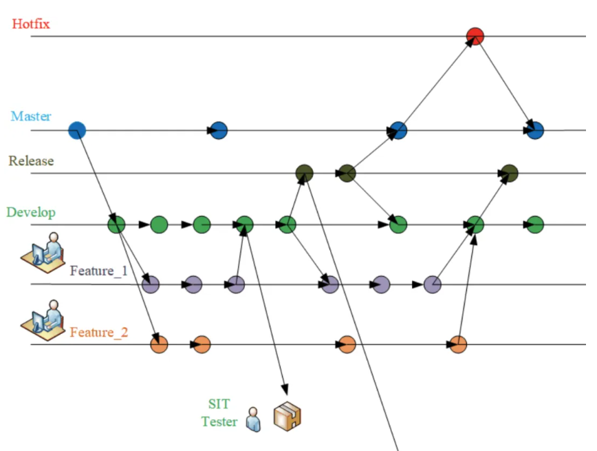

## 1. Branch Architecture & Workflow

    master              - Production (Protected, a pull request approval needed)
    ├── hotfix/*        - Critical fixes (E.g. hotfix/ranking-error)
    └── dev(default)    - Integration branch (Status checks required)
        ├── feature/*   - Feature development (E.g. feature/eda-radar-chart)
        └── release/*   - Pre-production staging (E.g. pre-release/v0.2.3)

__Update Logic__:
- __Master Branch__: The protected main branch, usually merged from `dev` and `hotfix` after Pull Requests(PR) have been approved, none shall change its content directly at no time for branch stability;

- __Dev Branch__: The development branch requiring status check, it is always consist of the most recently updated and fixed codes from all `feature/*` branches;

- Hotfix Branches: Created to fix a bug from `master`, merged back to `master` via a Pull Request(PR) after approvals;  

- __Feature Branches__: Created for a specific feature based on `dev`, merged back to `dev` via a status check;

- Release Branches: Cut from `dev` after some features of interest have been merged into `dev`, it will be released for testing and merged to `dev`given a success.  

- __Commit Message Header__ must follow this format: **type: subject**, for example, feat: lemmetization,  doc: add-radar-chart; 
    - __type__: can only be one of the following 7 labels:
        - feat
        - fix
        - doc
        - style (no execution change)
        - refactor
        - test
        - chore
    - __subject__: describe the purpose of this commit briefly. 

更多在[reference](https://mp.weixin.qq.com/s?__biz=MzU2OTkwNzAxMw==&mid=2247485475&idx=1&sn=57a5b22af2024a3a3affd626880953e8&chksm=fd9c360d2a51faeb90849c3e15f72fbef2231ad6467f40faf7cd2b4c110bb8d2824ad104141a#rd)

## 2. Integrate/Migrate your repos in 

There are 2 popular ways to port your existing repos in, and you can AI the detailed steps easily based on your needs and try your best to keep a linear history

    - Via git submodule
    - Via git subtree

<!---

# 2. **Enhanced Branch Protection**
# 3. **Migrating External Repositories as Feature Branches**
# 4. **Documentation Updates**

-->